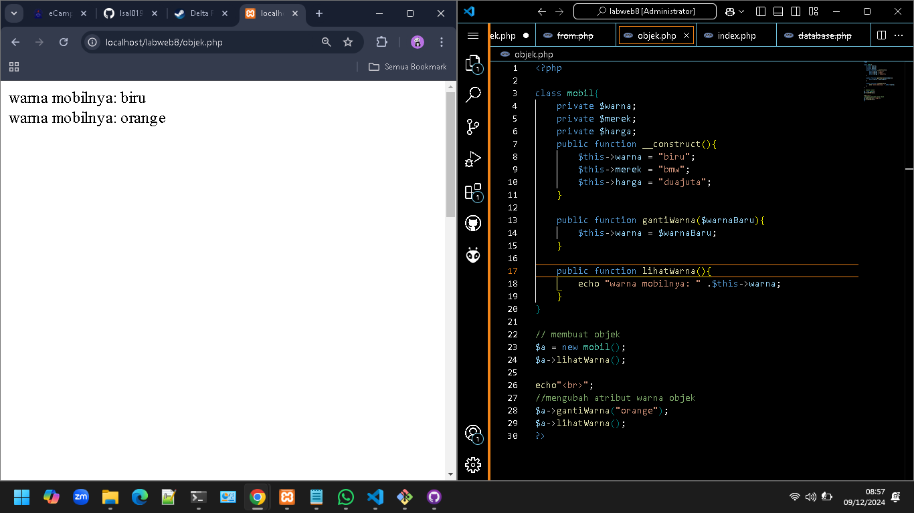
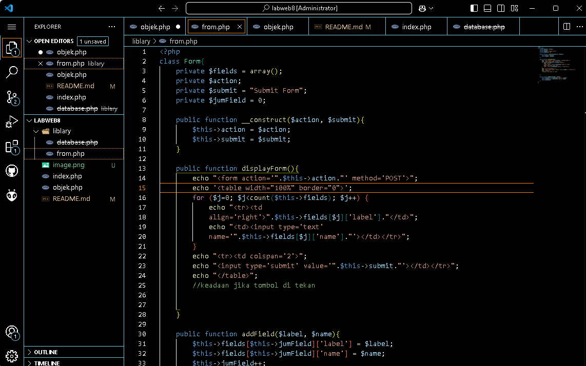
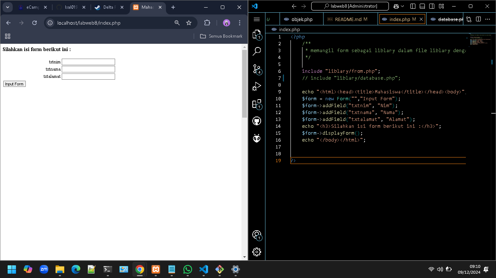

# labweb10

>membuat class objek

>membuat liblary form

>menginclude form

  

<h2>1. 1. Buat file baru dengan nama mobil.php</h2>

    <?php
    /**
    * Program sederhana pendefinisian class dan pemanggilan class.
    **/
    class Mobil
    {
        private $warna;
        private $merk;
        private $harga;
    
    public function __construct()
    {
        $this->warna = "Biru";
        $this->merk = "BMW";
        $this->harga = "10000000";
    }
        public function gantiWarna ($warnaBaru)
        {
            $this->warna = $warnaBaru;
        }
        public function tampilWarna ()
        {
           echo "Warna mobilnya : " . $this->warna;
        }
    }
    // membuat objek mobil
    $a = new Mobil();
    $b = new Mobil();
    
    // memanggil objek
    echo "<b>Mobil pertama</b> ";
    $a->tampilWarna();
    echo " Mobil pertama ganti warna ";
    $a->gantiWarna("Merah");
    $a->tampilWarna();
    
    // memanggil objek
    echo " <b>Mobil kedua</b> ";
    $b->gantiWarna("Hijau");
    $b->tampilWarna();
    
    ?>
    

Class & Object: Digunakan untuk merepresentasikan entitas mobil.
Encapsulation: Atribut seperti warna, merek, dan harga dibuat privat agar tidak dapat diakses langsung.
Constructor: Berfungsi untuk memberikan nilai awal secara otomatis saat objek dibuat.
Method: Digunakan untuk memodifikasi dan menampilkan data.

  

<h2>Buat file baru dengan nama form.php</h2>

    <?php
    /**
    * Nama Class: Form
    * Deskripsi: Class untuk membuat form inputan text sederhana
    **/
    class Form
    {
        private $fields = array();
        private $action;
        private $submit = "Submit Form";
        private $jumField = 0;
    
        public function __construct($action, $submit)
        {
            $this->action = $action;
            $this->submit = $submit;
        }
    
        public function displayForm()
        {
            echo "<form action='".$this->action."' method='POST'>";
            echo '<table width="100%" border="0">';
            for ($j = 0; $j < count($this->fields); $j++) {
                echo "<tr><td align='right'>".$this->fields[$j]['label']."</td>";
                echo "<td><input type='text' name='".$this->fields[$j]['name']."'></td></tr>";
            }
            echo "<tr><td colspan='2'>";
            echo "<input type='submit' value='".$this->submit."'></td></tr>";
            echo "</table>";
            echo "</form>";
        }
    
        public function addField($name, $label)
        {
            $this->fields[$this->jumField]['name'] = $name;
            $this->fields[$this->jumField]['label'] = $label;
            $this->jumField++;
        }
    }
    
    ?>

tidak muncul file apapun karena filenya belum terisi.

<h2>Buat file baru dengan nama form_input.php</h2>
    
      <?php
    /**
    * Program memanfaatkan Program 10.2 untuk membuat form inputan sederhana.
    **/
    include "form.php";
    echo "<html><head><title>Mahasiswa</title></head><body>";
    $form = new Form("","Input Form");
    $form->addField("txtnim", "Nim");
    $form->addField("txtnama", "Nama");
    $form->addField("txtalamat", "Alamat");
    echo "<h3>Silahkan isi form berikut ini :</h3>";
    $form->displayForm();
    echo "</body></html>";
    ?>

Kode tersebut merupakan implementasi dari class *Form* yang berfungsi untuk membuat formulir input sederhana. Program ini menggunakan class *Form* yang telah didefinisikan sebelumnya dalam file *form.php*.

  

<h2>Contoh lainnya untuk database connection dan query. Buat file dengan nama database.php</h2>
    
    <?php
    class Database {
        protected $host;
        protected $user;
        protected $password;
        protected $db_name;
        protected $conn;
    
        public function __construct() {
            $this->getConfig();
            $this->conn = new mysqli($this->host, $this->user, $this->password, $this->db_name);
    
            if ($this->conn->connect_error) {
                die("Connection failed: " . $this->conn->connect_error);
            }
        }
    
        private function getConfig() {
            include_once("config.php");
            global $config; // Pastikan $config bisa diakses
            $this->host = $config['host'];
            $this->user = $config['username'];
            $this->password = $config['password'];
            $this->db_name = $config['db_name'];
        }
    
        public function query($sql) {
            $result = $this->conn->query($sql);
            if ($result === false) {
                die("SQL Error: " . $this->conn->error);
            }
            return $result;
        }
    
        public function get($table, $where = null) {
            $condition = $where ? " WHERE $where" : "";
            $sql = "SELECT * FROM $table$condition";
            $result = $this->query($sql);
            return $result->fetch_assoc();
        }
    
        public function insert($table, $data) {
            if (is_array($data)) {
                $columns = implode(", ", array_keys($data));
                $values = implode(", ", array_map(fn($val) => "'{$this->conn->real_escape_string($val)}'", $data));
                $sql = "INSERT INTO $table ($columns) VALUES ($values)";
                return $this->query($sql);
            }
            return false;
        }
    
        public function update($table, $data, $where) {
            if (is_array($data)) {
                $update_values = implode(", ", array_map(fn($key, $val) =>
                    "$key='{$this->conn->real_escape_string($val)}'", array_keys($data), $data));
                $sql = "UPDATE $table SET $update_values WHERE $where";
                return $this->query($sql);
            }
            return false;
        }
    
        public function delete($table, $filter) {
            if (!empty($filter)) {
                $sql = "DELETE FROM $table WHERE $filter";
                return $this->query($sql);
            }
            return false;
        }
    }
    ?>
            
File database masih kosong karena belum ada data di dalamnya, sehingga perlu membuat tabel terlebih dahulu, serta menyiapkan file *config.php* dan *test.php*.

  

<h2>Membuat table dalam database mysql</h2>

    MariaDB [(none)]> use latihan1;
    Database changed
    MariaDB [latihan1]> create table users (
        -> id INT AUTO_INCREMENT PRIMARY KEY,
        -> nama VARCHAR(25) NOT NULL,
        -> email VARCHAR(30) NOT NULL);
    Query OK, 0 rows affected (0.035 sec)
    
    MariaDB [latihan1]> INSERT INTO users (nama, email) VALUES
        -> ('Nur Laila', 'nurlaila06@gmail.com'),
        -> ('Dita Tiara', 'dita123@gmail.com');
    Query OK, 2 rows affected (0.079 sec)
    Records: 2  Duplicates: 0  Warnings: 0

Setelah membuat tabel *users* di database *latihan1*, langkah selanjutnya adalah membuka VSCode dan membuat file baru dengan nama *config.php*.

  

<h2>config.php</h2>
    
    <?php
    $config = [
        'host' => 'localhost',     // Host database
        'username' => 'root',      // Username MySQL
        'password' => '',          // Password MySQL
        'db_name' => 'latihan1'    // Nama database
    ];
    ?>

berfungsi untuk menyimpan informasi konfigurasi koneksi database.

  

<h2>test.php</h2>
    
    <?php
      class Database {
      protected $host;
      protected $user;
      protected $password;
      protected $db_name;
      protected $conn;
      public function __construct() {
      $this->getConfig();
      $this->conn = new mysqli($this->host, $this->user, $this->password,
      $this->db_name);
      if ($this->conn->connect_error) {
      die("Connection failed: " . $this->conn->connect_error);
      }
      }
      private function getConfig() {
      include_once("config.php");
      $this->host = $config['host'];
      $this->user = $config['username'];
      $this->password = $config['password'];
      
      $this->db_name = $config['db_name'];
      }
      public function query($sql) {
      return $this->conn->query($sql);
      }
      public function get($table, $where=null) {
      if ($where) {
      $where = " WHERE ".$where;
      }
      $sql = "SELECT * FROM ".$table.$where;
      $sql = $this->conn->query($sql);
      $sql = $sql->fetch_assoc();
      return $sql;
      }
      public function insert($table, $data) {
      if (is_array($data)) {
      foreach($data as $key => $val) {
      $column[] = $key;
      $value[] = "'{$val}'";
      }
      $columns = implode(",", $column);
      $values = implode(",", $value);
      }
      $sql = "INSERT INTO ".$table." (".$columns.") VALUES (".$values.")";
      $sql = $this->conn->query($sql);
      if ($sql == true) {
      return $sql;
      } else {
      return false;
      }
      }
      public function update($table, $data, $where) {
      $update_value = "";
      if (is_array($data)) {
      foreach($data as $key => $val) {
      $update_value[] = "$key='{$val}'";
      }
      $update_value = implode(",", $update_value);
      }
      $sql = "UPDATE ".$table." SET ".$update_value." WHERE ".$where;
      $sql = $this->conn->query($sql);
      if ($sql == true) {
      return true;
      } else {
      
      return false;
      }
      }
      public function delete($table, $filter) {
      $sql = "DELETE FROM ".$table." ".$filter;
      $sql = $this->conn->query($sql);
      if ($sql == true) {
      return true;
      } else {
      return false;
      }
      }
      }
      ?>

file database masih kosong karena belum terisi, maka membuat dulu tablenya dan config.php dan test.php

  

<h2>pastikan nama database nya sudah sama</h2>

  

<h2>Membuat table dalam database mysql</h2>

    CREATE TABLE mahasiswa (
        ->     nim VARCHAR(20) PRIMARY KEY,
        ->     nama VARCHAR(100) NOT NULL,
        ->     alamat TEXT
        -> );
    Query OK, 0 rows affected (0.017 sec)

<h2>Lalu Input</h2>

  

<h2>config.php</h2>

    <?php
        $config = [
            'host' => 'localhost',
            'username' => 'root',
            'password' => '',
            'db_name' => 'latihan'
        ];
        ?>

berfungsi untuk menyimpan informasi konfigurasi koneksi database.

  

<h2>tampilkan data yang di input dengan select*from</h2>

  

<h1>TUGAS DAN JAWABAN</h1>

<h2>Implementasikan konsep modularisasi pada kode program pada praktikum sebelumnya dengan menggunakan class library untuk form dan database connection.
</h2>

  

<h2>1. Memuat file database2.php pada folder lab10_php_oop</h2>

Kode di atas merupakan kelas *Database* yang dirancang untuk mengelola koneksi dan operasi MySQL secara modular. Fitur utamanya meliputi koneksi otomatis, eksekusi query, serta mendukung operasi CRUD (Create, Read, Update, Delete) dengan penanganan kesalahan. Kelas ini menggunakan file *config.php* untuk membaca konfigurasi dan menjamin keamanan data melalui proses *escaping* input.

  

<h2>2. Membuat file form2.php</h2>

    <?php
          /**
          * Nama Class: Form
          * Deskripsi: CLass untuk membuat form inputan text sederhan
          **/
          class Form
          {
          private $fields = array();
          private $action;
          private $submit = "Submit Form";
          private $jumField = 0;
          public function __construct($action, $submit)
          {
          $this->action = $action;
          $this->submit = $submit;
          }
          public function displayForm()
          {
          echo "<form action='".$this->action."' method='POST'>";
          echo '<table width="100%" border="0">';
          for ($j=0; $j<count($this->fields); $j++) {
          echo "<tr><td
          align='right'>".$this->fields[$j]['label']."</td>";
          echo "<td><input type='text'
          name='".$this->fields[$j]['name']."'></td></tr>";
          }
          echo "<tr><td colspan='2'>";
          echo "<input type='submit' value='".$this->submit."'></td></tr>";
          echo "</table>";
          }
          public function addField($name, $label)
          {
          $this->fields [$this->jumField]['name'] = $name;
          $this->fields [$this->jumField]['label'] = $label;
          $this->jumField ++;
          }
          }
          ?>
Kode ini dirancang untuk memudahkan pembuatan formulir dinamis menggunakan PHP. Kelas *Form* memungkinkan saya menentukan *action* dan tombol submit, serta menambahkan field input beserta labelnya melalui metode *addField*. Formulir akan ditampilkan secara otomatis dalam format tabel menggunakan *displayForm*, sehingga lebih efisien dan mengurangi potensi kesalahan dibandingkan penulisan HTML secara manual.

  

<h2>3. Membuat form_input2.php</h2>

    <?php
        // Menghubungkan dengan file database.php
        include "database.php";
        
        if ($_SERVER['REQUEST_METHOD'] === 'POST') {
            $nim = $_POST['txtnim'];
            $nama = $_POST['txtnama'];
            $alamat = $_POST['txtalamat'];
            $db = new Database();
            $data = [
                'nim' => $nim,
                'nama' => $nama,
                'alamat' => $alamat
            ];
        
            if ($db->insert('mahasiswa', $data)) {
                echo "Data berhasil disimpan!";
            } else {
                echo "Gagal menyimpan data.";
            }
        } else {
            echo "<html><head><title>Mahasiswa</title></head><body>";
        
            class Form
            {
                private $fields = [];
                private $action;
                private $submit = "Submit Form";
                private $jumField = 0;
        
                public function __construct($action, $submit)
                {
                    $this->action = $action;
                    $this->submit = $submit;
                }
        
                public function displayForm()
                {
                    echo "<form action='" . $this->action . "' method='POST'>";
                    echo '<table width="100%" border="0">';
                    for ($j = 0; $j < count($this->fields); $j++) {
                        echo "<tr><td align='right'>" . $this->fields[$j]['label'] . "</td>";
                        echo "<td><input type='text' name='" . $this->fields[$j]['name'] . "'></td></tr>";
                    }
                    echo "<tr><td colspan='2'>";
                    echo "<input type='submit' value='" . $this->submit . "'></td></tr>";
                    echo "</table>";
                    echo "</form>";
                }
                public function addField($name, $label)
                {
                    $this->fields[$this->jumField]['name'] = $name;
                    $this->fields[$this->jumField]['label'] = $label;
                    $this->jumField++;
                }
            }
            $form = new Form("", "Submit Data");
            $form->addField("txtnim", "Nim");
            $form->addField("txtnama", "Nama");
            $form->addField("txtalamat", "Alamat");
        
            echo "<h3>Silahkan isi form berikut ini :</h3>";
            $form->displayForm();
            echo "</body></html>";
        }
        ?>

Kode ini menghasilkan formulir HTML untuk mengisi nama dan email mahasiswa menggunakan kelas *Form*. Formulir ini bersifat dinamis, mengarahkan data ke *insert.php* saat disubmit, dan ditampilkan dengan struktur HTML yang lengkap.

  

<h2>4. config2.php</h2>
    
    <?php
        $config = [
            'host' => 'localhost',
            'username' => 'root',
            'password' => '',
            'db_name' => 'latihan'
        ];
        ?>

Nama dan email yang diinput pengguna disimpan ke tabel *users* dalam database menggunakan kelas *Database*. Jika proses penyimpanan berhasil, akan muncul pesan "Data berhasil disimpan!", sedangkan jika terjadi kegagalan, pesan error akan ditampilkan.

  

